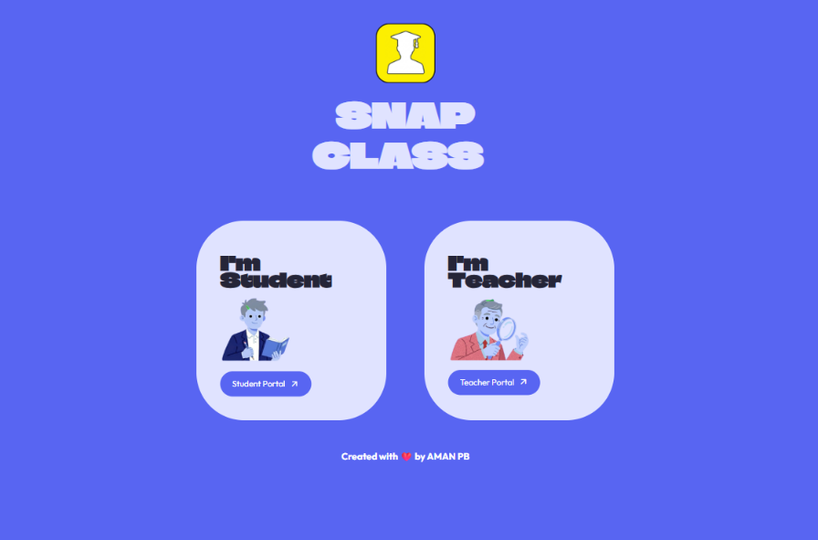
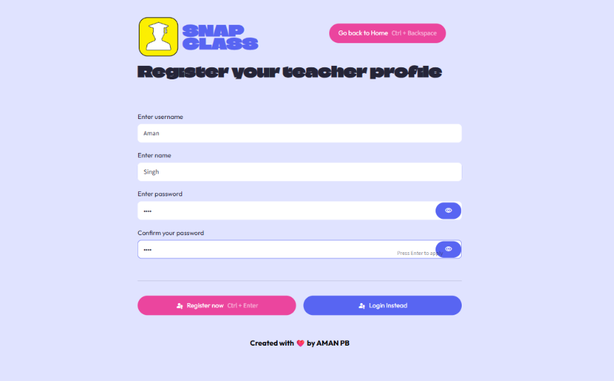
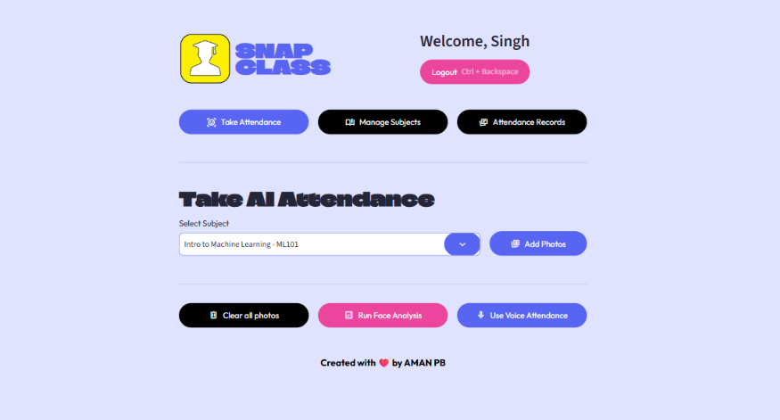
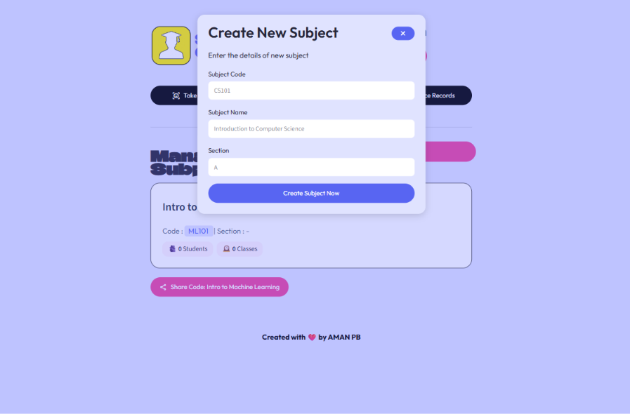
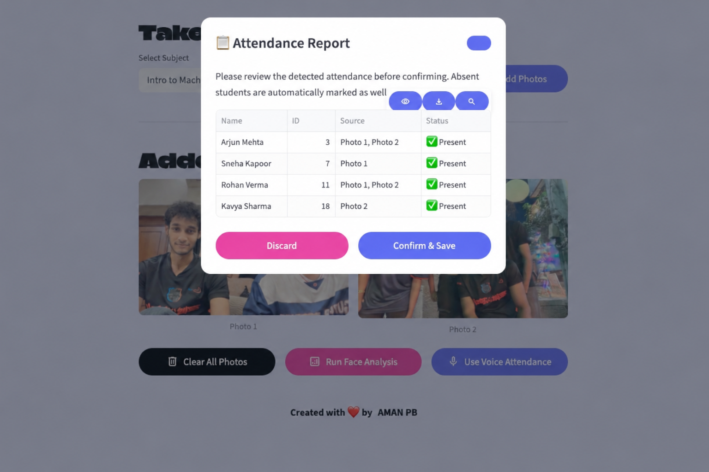
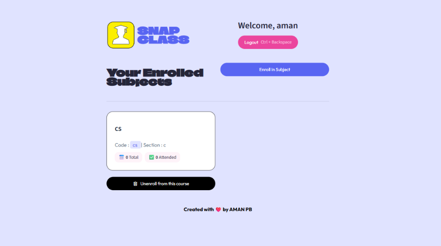

# SnapClass Landing Page

<p align="center">
	<strong>A polished product landing page for SnapClass, an AI-powered classroom attendance platform.</strong>
</p>

<p align="center">
	<a href="https://snapclass-aman.streamlit.app/">Open the live SnapClass app</a>
	&nbsp; | &nbsp;
	<a href="https://github.com/Aman05cody/snapclass-landing">View the source repository</a>
</p>



## Overview

This repository contains the SnapClass marketing and product-experience landing page. It introduces the platform, explains the teacher and student workflows, highlights the AI attendance features, and links visitors to the live attendance application.

The landing page is intentionally a small Flask application. The actual attendance experience is hosted separately as a Streamlit application and is available here:

**[Launch SnapClass AI Attendance](https://snapclass-aman.streamlit.app/)**

## What SnapClass Offers

- **AI face analysis** for recognizing students from a class photo.
- **Sequential voice identification** for hands-free roll calls using voice embeddings.
- **QR-driven enrollment** for quickly joining a course without manual roster entry.
- **Teacher workflows** for secure login, course creation, attendance capture, and record management.
- **Student workflows** for enrollment, biometric registration, and attendance tracking.
- **Actionable records** with historical attendance views, confidence scores, and CSV export support in the product experience.

## Landing Page Experience

The page is organized around the way educators use SnapClass:

1. A focused hero section links directly to the live application.
2. Feature cards introduce face, voice, and QR-based attendance.
3. The teacher journey walks through login, dashboard, course management, biometric attendance, and records.
4. The student journey covers enrollment, biometric registration, and the student dashboard.
5. The technology section explains the platform, computer vision, audio AI, and cloud storage layers.

The frontend also includes responsive styling, custom typography, product screenshots, sticky navigation, and scroll-reveal interactions.

## Technology

| Layer | Technology |
| --- | --- |
| Web server | Flask |
| Template engine | Jinja2 through Flask templates |
| Styling | Custom CSS with Google Fonts |
| Interactions | Vanilla JavaScript and Intersection Observer |
| Deployment | Vercel Python runtime |
| Product link | Streamlit |

The landing page itself does not implement biometric recognition or attendance storage. Those capabilities belong to the linked SnapClass application.

## Project Structure

```text
.
├── app.py                    # Flask application and route entrypoint
├── requirements.txt          # Python runtime dependencies
├── vercel.json               # Vercel build and routing configuration
├── templates/
│   └── index.html             # Landing page markup
└── static/
		├── css/style.css          # Visual design and responsive layout
		├── js/script.js           # Scroll-reveal behavior
		├── fonts/                 # Local font assets, when used
		└── img/demo/              # Product workflow screenshots
```

## Run Locally

### Prerequisites

- Python 3.9 or newer
- Git

### Setup

```bash
git clone https://github.com/Aman05cody/snapclass-landing.git
cd snapclass-landing

python -m venv .venv
```

Activate the virtual environment:

**Windows PowerShell**

```powershell
.\.venv\Scripts\Activate.ps1
```

**macOS or Linux**

```bash
source .venv/bin/activate
```

Install dependencies and start the development server:

```bash
pip install -r requirements.txt
python app.py
```

Open [http://localhost:5002](http://localhost:5002) in your browser.

The development server runs with Flask debug mode enabled and listens on port `5002`, as configured in `app.py`.

## Deploy to Vercel

This repository already includes `vercel.json` for the Vercel Python runtime.

1. Import the repository into Vercel.
2. Keep the project root pointed at the folder containing `app.py` and `vercel.json`.
3. Deploy without adding a build command.
4. Vercel routes incoming requests to the Flask application through `app.py`.

For a CLI deployment, install the Vercel CLI, authenticate, and run:

```bash
npx vercel
```

## Updating Content

- Edit page copy, sections, and links in `templates/index.html`.
- Edit colors, layout, responsive rules, and typography in `static/css/style.css`.
- Edit entrance animations and browser interactions in `static/js/script.js`.
- Add or replace product screenshots in `static/img/demo/` and update the matching image references in the template.
- Keep the live product URL consistent wherever the call-to-action appears: `https://snapclass-aman.streamlit.app/`.

## Screenshots

### Teacher workflow

| Login | Dashboard |
| --- | --- |
|  |  |

| Course creation | Photo attendance |
| --- | --- |
|  |  |

### Student workflow

| Enrollment | Student dashboard |
| --- | --- |
|  |  |

## License

No license file is currently included in this repository. Add a license before distributing or reusing the project outside its intended deployment.